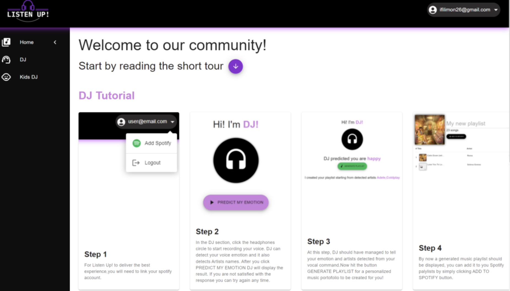
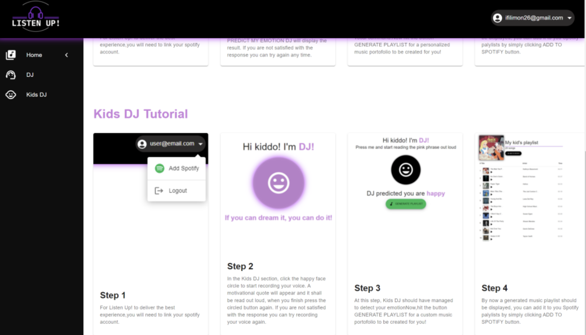
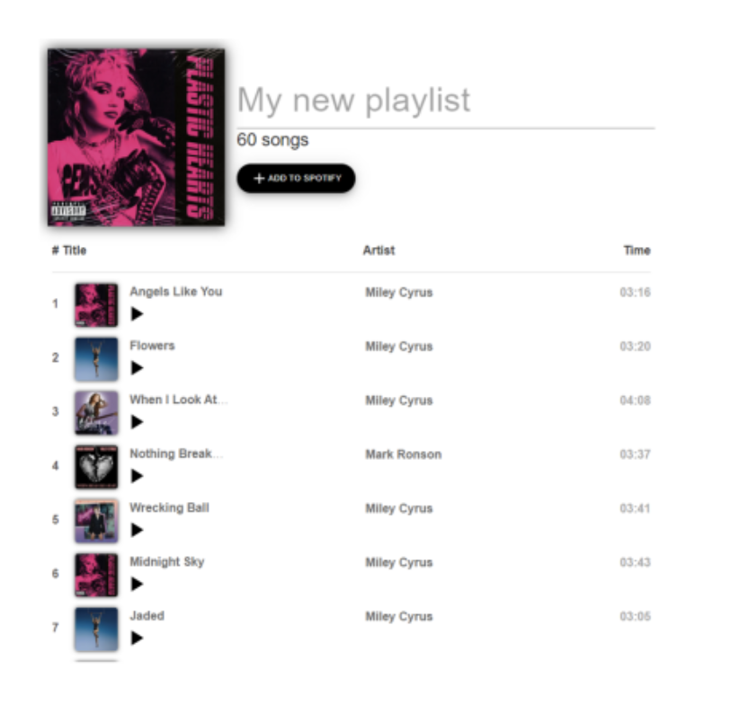
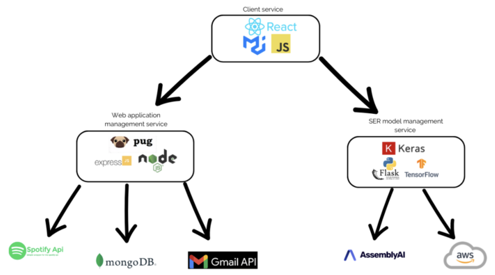
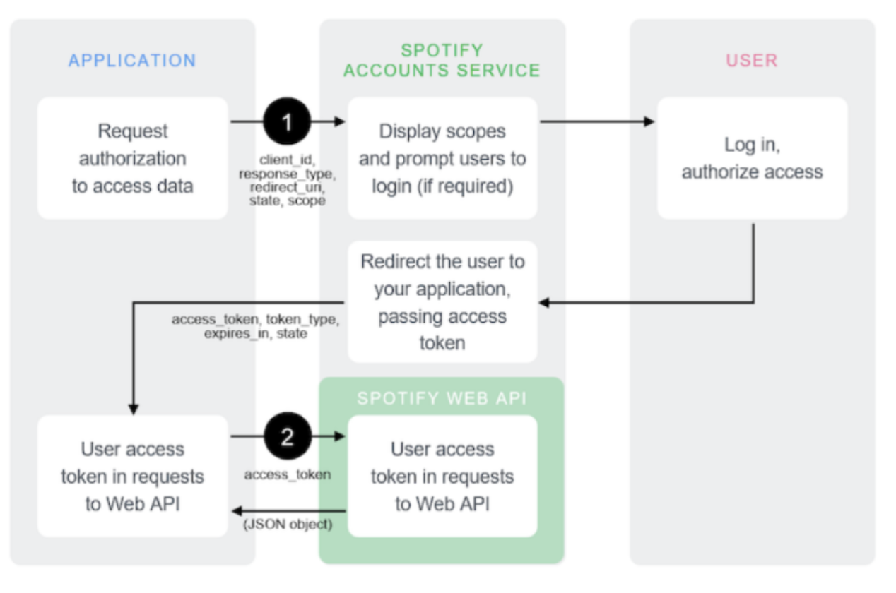

# ListenUP - Emotion-Aware Spotify Playlist Generator

Generate Spotify playlists from your voice. **Listen Up!** detects **happiness** or **sadness** from a short voice recording, optionally recognizes artists you mention, then recommends tracks and can save the playlist to your Spotify account. It offers two modes—**DJ** (general users) and **Kids DJ** (child-friendly recommendations).

How many times have you wondered what to listen to today — whether for a long car drive or a quick run?
Even creating a playlist for a party takes time.

The idea behind this project also applies to situations when you can’t drive and type on your phone, or when you simply want to quickly create a music playlist for your child to fall asleep.

Mobile apps can be developed starting from this idea.

Generating a music playlist that you actually like takes time and doesn’t always match your mood.

This project is based on my graduation thesis paper, which can be found here: [Graduation Thesis (ro)](https://drive.google.com/file/d/1gODLcJE1iEMMcwsWlfz0VABqT2SUVtAi/view)


# Intro project structure
* /client - React application
* /server - Server written in NodeJS
* /model-server - Simple Python application that would be called for model inference

# Application view
ListenUp main page




ListenUp kids version



Generated playlist




## Table of Contents

- [Features](#features)
- [Architecture Overview](#architecture-overview)
- [Monorepo Structure](#monorepo-structure)
- [Services](#services)
  - [ML Service (Python/Flask)](#ml-service-pythonflask)
  - [App Backend (NodejsExpress)](#app-backend-nodejsexpress)
  - [Web Client (React)](#web-client-react)
- [External Integrations](#external-integrations)
- [Security Model](#security-model)
- [Data Model (MongoDB)](#data-model-mongodb)
- [Getting Started (Local Dev)](#getting-started-local-dev)
  - [Prerequisites](#prerequisites)
  - [Environment Variables](#environment-variables)
  - [Install & Run](#install--run)
- [API Endpoints (Overview)](#api-endpoints-overview)
- [User Flows](#user-flows)
- [Production Notes](#production-notes)
- [Limitations](#limitations)
- [Roadmap](#roadmap)
- [License](#license)
- [Acknowledgements](#acknowledgements)

---

## Features

- 🎙️ **Voice Emotion Detection** (happy/sad) using a trained ML model.
- 🧠 **Speech-to-Text** via AssemblyAI to extract keywords and artists you say.
- 🎧 **Spotify Integration**
  - OAuth login and account linking.
  - Track recommendations and playlist creation.
  - Save generated playlists to the user’s Spotify library.
- 👨‍👩‍👧 **Two modes**
  - **DJ:** general recommendations + optional artist recognition.
  - **Kids DJ:** child-appropriate music using Spotify genre seeds (`children`, `happy`, `disney`, `dance`).
- 🔐 **Account System**
  - Sign up, email verification (OTP), login, logout, password reset.
  - HTTP-only cookies + JWT.
- 📨 **Email delivery** using Gmail API (OAuth2) with Pug templates for rich HTML emails.
- 🗂️ **Clean React front end** with MUI, Redux for state, Axios for HTTP, Notistack for notifications.

---

## Architecture Overview

ListenUp minimalist architecture



Interraction between application and Spotify API



- The **front end** (React) is separate from back ends; all communication over HTTP/HTTPS.
- The **ML service** (Python/Flask) handles emotion prediction and speech-to-text orchestration.
- The **App backend** (Node/Express) handles auth, user management, Spotify integration, email, and persistence.

---

## Services

### ML Service (Python/Flask)

**Responsibilities**
- Accept an audio recording (`multipart/form-data`), convert to an **RGB image tensor** in memory, run the trained model, and return:
  - `predictedEmotion` → `"happy"` or `"sad"`
  - `predictionArray` → class scores
- Proxy speech-to-text via AssemblyAI:
  - Upload audio to AssemblyAI’s upload endpoint.
  - Request transcription and return result JSON.

**Key routes**
- `POST /` — form field `recording` → `{ predictedEmotion, predictionArray }`
- `POST /speech-to-text` — form field `recording` → transcription JSON

> In-memory image processing keeps the service stateless (no temp files).

---

### App Backend (Node.js/Express)

**Responsibilities**
- User accounts (signup, verify email, login, logout, password reset).
- Spotify OAuth (login, callback) and API calls for recommendations and playlist creation.
- Email via Gmail API (OAuth2) using **Nodemailer** + **Pug** templates.
- Data persistence in **MongoDB** (users, OTP verifications).

**Notes**
- Spotify **access token** is valid ~1 hour; the service refreshes automatically using the **refresh token**.
- The React client never calls Spotify directly; only the backend does.

---

### Web Client (React)

**Stack**
- React + MUI (Material UI)
- Redux (global state: `account`, `playlistRecommendation`, `route`, `dataForMusicRecommendation`)
- Axios for HTTP; Notistack for toasts/alerts
- Protected routes: unauthenticated users are redirected to `/login`

**Pages**
- Auth: Login, Sign Up, Forgot/Reset Password (with client-side validations)
- Home: short tutorial for DJ and Kids DJ
- DJ: record voice → emotion prediction → optional artist detection → generate playlist → save to Spotify
- Kids DJ: show a random quote; record reading → emotion prediction → child-safe playlist → save to Spotify

---

## External Integrations

- **Spotify Web API**
  - Requires a Spotify Developer app and **Premium** account to fully use playback/extended features.
  - Used for recommendations (GET) and playlist creation (POST).
- **AssemblyAI**
  - Free tier used for speech-to-text (≈ **3 hours/month**).
  - Flow: upload recording → request transcription → return result.
- **Gmail API (OAuth2)**
  - For verification and reset emails (rich HTML via Pug templates).
  - Requires a Google Cloud project and OAuth credentials + consent configuration.

---

## Security Model

- **Auth cookies**: HTTP-only cookies store session/JWT; client checks a boolean in Redux derived from server-set cookies.
- **JWT** encodes the user email; typical client-side lifetime is **2 days**.
- **OTP** (One-Time Password)
  - Alphanumeric code stored with `createdAt` and `expiresAt` (24h).
  - Used for email verification and password reset.
  - Deleted upon successful verification.
- **Route Guards**: Client-side protected routes and server middleware to verify tokens.

---

## Data Model (MongoDB)

**Collections**

`users`
```js
{
  email: String,                  // unique identifier
  password: String,               // hashed
  permissions: Object,            // role/claims if any
  verified: Boolean,
  createdDate: String,
  access_token: String,           // app auth (if applicable)
  spotify_verified: Boolean,
  spotify_access_token: String,
  spotify_refresh_token: String
}
```
## API Endpoints (Overview)

### App Backend (Express)

**Auth**
- `POST /auth/signup`
- `POST /auth/login`
- `POST /auth/logout`
- `GET  /auth/verify-email?code=<otp>`
- `POST /auth/forgot-password`
- `POST /auth/reset-password`

**Spotify**
- `GET  /auth/spotify/login`     → redirect to Spotify OAuth
- `GET  /auth/spotify/callback`  → store access/refresh tokens
- `POST /spotify/recommendations` → returns track list (accepts mood/artists/seed genres)
- `POST /spotify/playlist`        → creates/saves playlist in the user’s Spotify account

---

## User Flows

### DJ
1. Record a short voice sample.
2. ML service predicts **happy/sad**; speech-to-text extracts optional artist names.
3. Backend requests recommendations from Spotify (artists + mood).
4. User previews results, optionally **names the playlist**, and saves it to Spotify.

### Kids DJ
1. App shows a random short motivational quote.
2. Child reads it aloud; the recording is sent to the ML service.
3. Backend requests recommendations using **child-safe seed genres**.
4. Playlist is shown; user can save it to Spotify.

---

## Production Notes

- **Model Serving**
  - The trained model can be large for low-memory VMs.
  - Consider converting to **TensorFlow Lite (TFLite)** to reduce memory usage and improve load times on constrained environments.
  - Evaluate performance before/after conversion to ensure quality is preserved.

- **Token Management**
  - Spotify access tokens expire in ~1 hour; always refresh before API calls to avoid client-visible errors.

- **Email (Gmail API)**
  - OAuth2 access tokens expire—use refresh tokens and rotate credentials if revoked.

- **Stateless ML Service**
  - Keep processing in-memory (no temp files) to simplify scaling and deployment.

---

## Limitations

- Due to copyright, **audio playback is not provided outside Spotify**.
- AssemblyAI free plan limits transcription to roughly **3 hours/month**.

---

## Roadmap

- [ ] Use OpenAI to analyze the user playlist desire from voice
- [ ] Multi-emotion classification (beyond happy/sad)
- [ ] Finer mood/energy mapping to Spotify audio features
- [ ] In-app playlist editing (re-rank, swap, lock tracks)
- [ ] Docker Compose for one-command local setup
- [ ] Internationalized UI & accessibility improvements

---

## License

This project is licensed under the **MIT License**. See `LICENSE` for details.

## Acknowledgements

- Spotify Web API  
- AssemblyAI  
- Gmail API / Google Cloud  
- MUI, Redux, Axios, Notistack, Nodemailer, Pug